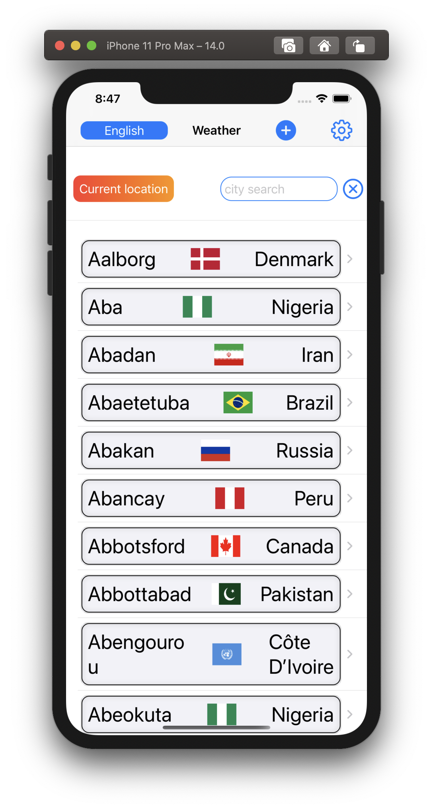
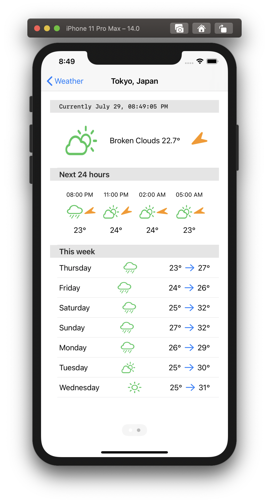

# SwiftUI Weather App, using OpenWeather One Call API library 

  
   

## Yet Another Weather App (YAWA)

Yes, another basic weather app. This time to showcase my very own [**OWOneCall**](https://github.com/workingDog/OWOneCall) swift library.

## OWOneCall

[**OWOneCall**](https://github.com/workingDog/OWOneCall) is a small Swift library to connect to the [OpenWeather One Call API](https://openweathermap.org/api/one-call-api) and retrieve the chosen weather data. Made easy to use with SwiftUI.

Provides for current, forecast and historical weather data through a single function call.

### Requirement

Requires a valid OpenWeather key, there is a free plan, see:

-    [OpenWeather how to start](https://openweathermap.org/appid)

Use the settings (the gear button) to enter your **openweather key**. Once saved, it will be used the next time.
Similarly, set your default language, and it will be used the next time.

For ios 14 and macos 11

### References

-  [Simplemaps: World Cities Database](https://simplemaps.com/data/world-cities)

-  [worldcities_clean.csv](https://gist.github.com/curran/13d30e855d48cdd6f22acdf0afe27286)

